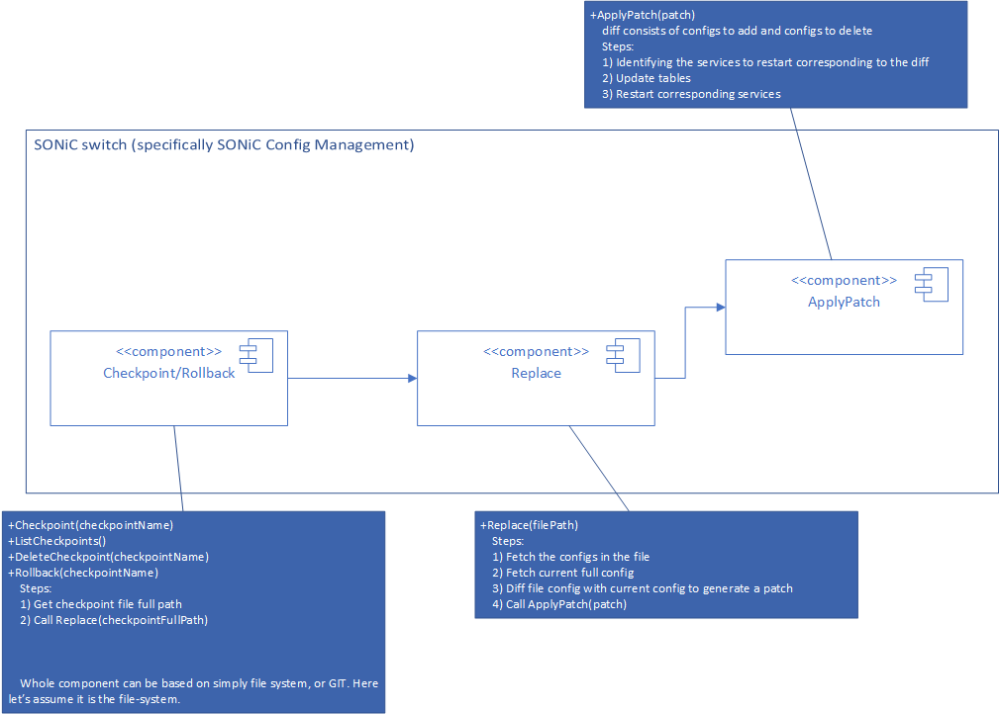

# SONiC Config Management POC
## Setup
1) install pythong jsonpatch on SONiC box from [here](https://pypi.org/project/jsonpatch/)
2) Copy the whole `config-mgmt` over to SONiC box

## Design


## Commands
```bash
❯ ./apply-patch.py -h
usage: apply-patch.py [-h] -p PATCH_FILE [-v] [-d] [-c CURRENT_JSON]

Apply JSON patch to ConfigDB

optional arguments:
  -h, --help            show this help message and exit
  -p PATCH_FILE, --patch-file PATCH_FILE
                        Path to patch file
  -v, --verbose         show logs on CLI
  -d, --dry-run         do a dry-run
  -c CURRENT_JSON, --current-json CURRENT_JSON
                        Path to current config file, use with '-d, --dry-run' option
```

```bash
❯ ./config-replace.py -h
usage: config-replace.py [-h] -j JSON [-v] [-d] [-c CURRENT_JSON]

Replace full ConfigDb JSON configs

optional arguments:
  -h, --help            show this help message and exit
  -j JSON, --json JSON  Path to json file containing full config
  -v, --verbose         show logs on CLI
  -d, --dry-run         do a dry-run
  -c CURRENT_JSON, --current-json CURRENT_JSON
                        Path to current config file, use with '-d, --dry-run' option
```

For `checkpoint, list-checkpoints, delete-checkpoint, rollback` just type `-h` as the single parameter, and you should get the help menu.

## Explanation
### Apply-Patch
Applies the given JsonPatch on ConfigDb
* Formal JsonPatch RFC document [here](https://tools.ietf.org/html/rfc6902)
* Supports the JsonPatch operations: `remove, add, replace`
* Not sure if we should support the rest of the operation
* Works internall by converting configlet (as defined [here](https://github.com/Azure/sonic-utilities/blob/master/scripts/configlet))
* Configlet tool accepts a JSON file, and an operation either `update` or `delete`
* Configlet tool `update` works by making sure configs in the json file is pushed into the device. That's it. Think of it as a push configlet operation. It does not delete any config. `delete` in configlet tool, can help delete configs.
* `add` operation is actually a replace in most cases so when converting to configlet, it was split into 2 operations. First delete the whole target json using `configlet -d`, then update using `configlet -u`.
* JsonPatch references items in a list by the index but configlet does not do that, it only understands dictionary keys. And I noticed that lists appear only as leaf nodes in ConfigDb config. So whenever I am updating a single index, I just replace the whole list. This helps insert/replace items in their correct location.
* Ordering of tables and selecting which services to restart is done based the document [here](https://github.com/renukamanavalan/sonic-buildimage/blob/hitless/files/image_config/config_info/README)
* One issue I don't like about the ordering methodology suggested above, is that it relies on groupings of tables. Adding more tables can cause the groupings to be very confusing as the grouping order needs to change. I think a better approach is just to specifiy for each table what other tables it depends on and needs to be restarted first. (i.e. build a topology and do toplogicial sorting based on that)

Wrks as follows:
1. convert patch file to configlet (as defined [here](https://github.com/Azure/sonic-utilities/blob/master/scripts/configlet))
2. Order configlets as some table need to show up before others (as defined [here](https://github.com/renukamanavalan/sonic-buildimage/blob/hitless/files/image_config/config_info/README))
3. Add service in need of restart (as defined [here](https://github.com/renukamanavalan/sonic-buildimage/blob/hitless/files/image_config/config_info/README))
4. Apply the configlets and the service-restart in order

### Config-Replace
Replaces the full config given in the checkpoint into running config, works as follows:
1. Getting checkpoint config
2. Getting running config
3. Generating patch using jsonpath.make_patch (as defined [here](https://python-json-patch.readthedocs.io/en/latest/tutorial.html#creating-a-patch))
4. Apply-patch by calling `Apply-Patch` method defined above
5. Verify patch is applied to ConfigDb, generating the patch again between running/checkpiont configs. This time it should be empty.

### Checkpoint
Creates a checkpoint using the specified checkpoint name.
1. Gets running config
2. Saves running config to the checkpoint location

### Rollback-config
Rolls back the config to the specified checkpoint
1. Gets checkpoint file path
2. Calls `Config-Replace` method defined above pass the checpoint file path

### Other functions
They should be easy to understand.